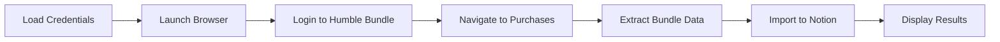

# Humble Bundle Purchase History Scraper

This script automatically logs into your Humble Bundle account and imports your purchase history into your Notion Bundles database.

## Setup

### 1. Add Your Credentials

Edit the `.env.humble` file and add your Humble Bundle login credentials:

```bash
nano .env.humble
```

Replace the placeholder values with your actual credentials:

```
HUMBLE_EMAIL=your_actual_email@example.com
HUMBLE_PASSWORD=your_actual_password
NOTION_TOKEN=your_notion_integration_token
```

**Important:** Never commit `.env.humble` to git! It's already in `.gitignore` to protect your credentials.

### 2. Run the Scraper

Simply run:

```bash
./run-humble-scraper.sh
```

Or run directly with Node:

```bash
export $(cat .env.humble | grep -v '^#' | xargs)
node scrape-humble-bundle.js
```

## What It Does

1. **Logs into Humble Bundle** using your credentials
2. **Navigates to your purchases** page
3. **Extracts bundle names and purchase dates**
4. **Imports them into Notion** Bundles database

## Features

- ✅ Headless browser automation with Puppeteer
- ✅ Secure credential handling via environment variables
- ✅ Automatic date parsing and formatting
- ✅ Progress reporting
- ✅ Error handling with debug screenshots
- ✅ Duplicate detection (won't re-import existing bundles)

## Troubleshooting

### Login Issues

If the scraper can't log in:

1. Check your credentials in `.env.humble`
2. Make sure you don't have 2FA enabled (or handle it manually)
3. Run with `headless: false` (already set) to see what's happening

### No Purchases Found

If the scraper finds 0 purchases:

1. Check the debug screenshot: `humble-bundle-debug.png`
2. Humble Bundle might have changed their page structure
3. You may need to update the CSS selectors in the script

### Page Structure Changed

Humble Bundle occasionally updates their website. If selectors stop working:

1. Open the screenshot (`humble-bundle-debug.png`)
2. Inspect the HTML structure
3. Update the selectors in `scrape-humble-bundle.js`

Common selectors to check:
- `.js-subscription-product-list` - Purchase list container
- `.subproduct-selector` - Individual purchase item
- `.item-title`, `.human-name` - Bundle name
- `.purchase-date`, `time` - Purchase date

## Security Notes

- ⚠️ **Never share `.env.humble`** - it contains your password
- ⚠️ **Never commit credentials** to git
- ✅ The `.env.humble` file is already in `.gitignore`
- ✅ Credentials are only stored locally on your machine
- ✅ The script only connects to Humble Bundle and Notion

## Customization

### Change Headless Mode

To run the browser invisibly (faster):

Edit `scrape-humble-bundle.js` line 31:

```javascript
headless: true,  // Change false to true
```

### Adjust Timeouts

If the scraper is timing out, increase wait times:

```javascript
await page.waitForNavigation({ waitUntil: 'networkidle2', timeout: 60000 }); // Increase from 30000
```

## How It Works



1. **Authentication**: Logs in using Puppeteer
2. **Navigation**: Goes to `/home/purchases`
3. **Scraping**: Extracts bundle names and dates using CSS selectors
4. **Parsing**: Converts dates to YYYY-MM-DD format
5. **Import**: Creates Notion pages via API

## Files Created

- `scrape-humble-bundle.js` - Main scraper script
- `.env.humble` - Your credentials (NEVER commit!)
- `run-humble-scraper.sh` - Helper script to run scraper
- `humble-bundle-debug.png` - Debug screenshot (if no purchases found)
- `humble-bundle-error.png` - Error screenshot (if scraper fails)

## Next Steps

After importing your bundles, you can:

1. View them in your Bundles database
2. Add books to those bundles in the Books database
3. Link books to multiple bundles as needed

Enjoy automated Humble Bundle tracking! 📚
